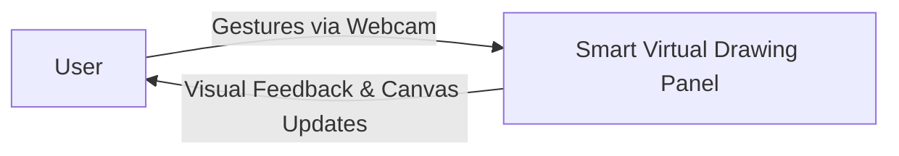

# Smart Virtual Drawing Panel

**Project Description:**
The Smart Virtual Drawing Panel is a web-based, gesture-controlled digital whiteboard. It allows users to draw, erase, pan, zoom, and manipulate objects on a canvas entirely through hand gestures captured by a webcam, eliminating the need for a mouse or keyboard. The project operates as a 100% Client-Side Single Page Application (SPA), leveraging WebAssembly to run complex machine learning models directly in the browser at near-native speeds. It features an object-oriented canvas that provides an interactive object model to easily create, select, drag, scale, and manipulate free-hand drawings and shapes in real-time.

**Project Objective:**
- To create an intuitive and futuristic digital canvas controlled entirely by real-time hand gestures.
- To eliminate the need for physical input devices (mouse/keyboard) during brainstorming or drawing sessions.
- To use modern web technologies and hardware-accelerated machine learning (MediaPipe via WebAssembly) inside the browser.
- To provide advanced features such as smart selection, global pinch zoom, tool hovering, and object-based raycast erasing.

**Technology Stack:**
- **Frontend Framework:** React (with Vite)
- **Language:** TypeScript
- **Canvas Engine:** Fabric.js
- **Machine Learning (NNDL):** Google MediaPipe (`@mediapipe/tasks-vision`)
- **Styling:** Tailwind CSS
- **Animations:** Framer Motion

---

### Project DFD

**1. DFD (Level 0) - (Context Diagram)**


**Data Flows:**
- User → Platform: Hand gesture video stream.
- Platform → User: Rendered canvas updates, hover progressions, tool selections, and camera preview.

**2. DFD (Level 1) - Functional Breakdown**
```mermaid
graph TD
A[User / Webcam] -->|Video Stream| B[MediaPipe Hand Landmarker]
B -->|3D Hand Coordinates| C[Gesture Logic Engine]
C -->|Gesture Commands (Draw, Erase, Pan, Pinch)| D[Fabric.js Canvas Engine]
D -->|Render Updated Objects| E[UI Display & Toolbar]
```

**Data Flows:**
- Webcam → Hand Landmarker: Raw video frames.
- Hand Landmarker → Logic Engine: Extracted `[x, y, z]` coordinates of 21 specific hand points.
- Logic Engine → Canvas Engine: State machine outputs such as `MOVE_CANVAS`, `DRAW`, `ERASE`, and `PINCH`.

---

### Folder Structure
```text
gesture-canvas/
├── PROJECT_DOCUMENTATION.md
├── README.md
├── package.json
├── vite.config.ts
├── src/
│   ├── App.tsx
│   ├── index.css
│   ├── main.tsx
│   ├── components/
│   │   ├── CameraPreview.tsx
│   │   ├── CanvasBoard.tsx
│   │   ├── NavLink.tsx
│   │   ├── ShapeTools.tsx
│   │   └── Toolbar.tsx
│   └── services/
│       └── useGestureControl.ts
```

---

### SOURCE CODE

**src/App.tsx:**
```tsx
import { QueryClient, QueryClientProvider } from "@tanstack/react-query";
import { BrowserRouter, Route, Routes } from "react-router-dom";
import { Toaster as Sonner } from "@/components/ui/sonner";
import { Toaster } from "@/components/ui/toaster";
import { TooltipProvider } from "@/components/ui/tooltip";
import Index from "./pages/Index.tsx";
import DrawingApp from "./pages/DrawingApp.tsx";
import NotFound from "./pages/NotFound.tsx";

const queryClient = new QueryClient();

const App = () => (
  <QueryClientProvider client={queryClient}>
    <TooltipProvider>
      <Toaster />
      <Sonner />
      <BrowserRouter>
        <Routes>
          <Route path="/" element={<Index />} />
          <Route path="/app" element={<DrawingApp />} />
          <Route path="*" element={<NotFound />} />
        </Routes>
      </BrowserRouter>
    </TooltipProvider>
  </QueryClientProvider>
);

export default App;
```

**src/services/useGestureControl.ts (Core Logic Snippet):**
```typescript
import { useEffect, useRef, useState, MutableRefObject } from 'react';
import { FilesetResolver, HandLandmarker, HandLandmarkerResult } from '@mediapipe/tasks-vision';

export type GestureCommand = {
  gesture: string;
  x: number;
  y: number;
  dx?: number;
  dy?: number;
  pinch_dist?: number;
  hover_progress?: number;
};

// Euclidean distance utility
const distance = (p1: { x: number, y: number }, p2: { x: number, y: number }) => {
  return Math.sqrt(Math.pow(p1.x - p2.x, 2) + Math.pow(p1.y - p2.y, 2));
};

export function useGestureControl(videoRef: MutableRefObject<HTMLVideoElement | null>) {
  const [command, setCommand] = useState<GestureCommand | null>(null);
  const landmarkerRef = useRef<HandLandmarker | null>(null);

  useEffect(() => {
    let animationFrameId: number;
    const initializeLandmarker = async () => {
      try {
        const vision = await FilesetResolver.forVisionTasks("https://cdn.jsdelivr.net/npm/@mediapipe/tasks-vision@0.10.3/wasm");
        const landmarker = await HandLandmarker.createFromOptions(vision, {
          baseOptions: {
            modelAssetPath: "https://storage.googleapis.com/mediapipe-models/hand_landmarker/hand_landmarker/float16/1/hand_landmarker.task",
            delegate: "GPU"
          },
          runningMode: "VIDEO",
          numHands: 1,
        });
        landmarkerRef.current = landmarker;
      } catch (err) {
        console.error("Failed to initialize MediaPipe", err);
      }
    };
    initializeLandmarker();
    // Implementation of processing continues...
  }, []);

  const handleGestures = (results: HandLandmarkerResult) => {
    // Coordinate extraction and gesture machine logic processing (Draw, Pan, Pinch, etc.)
    // ...
  };

  return { lastCommand: command };
}
```

**src/components/CameraPreview.tsx:**
```tsx
import React, { useEffect, useRef } from "react";
import { motion } from "framer-motion";
import { Video } from "lucide-react";

export const CameraPreview = ({ videoRef }: { videoRef: React.RefObject<HTMLVideoElement | null> }) => {
  useEffect(() => {
    let stream: MediaStream | null = null;
    
    const startCamera = async () => {
      try {
        stream = await navigator.mediaDevices.getUserMedia({ video: true });
        if (videoRef.current) {
          videoRef.current.srcObject = stream;
        }
      } catch (err) {
        console.error("Failed to access camera", err);
      }
    };

    startCamera();

    return () => {
      if (stream) {
        stream.getTracks().forEach(track => track.stop());
      }
    };
  }, [videoRef]);

  return (
    <motion.div
      initial={{ opacity: 0, scale: 0.9 }}
      animate={{ opacity: 1, scale: 1 }}
      exit={{ opacity: 0, scale: 0.9 }}
      className="absolute bottom-16 right-4 w-64 aspect-video glass-panel-strong rounded-2xl overflow-hidden border border-primary/30 z-30"
      style={{ boxShadow: "0 0 30px rgba(34,211,238,0.15)" }}
    >
      <div className="absolute top-2 left-2 px-2 py-0.5 bg-primary text-primary-foreground text-[9px] font-bold uppercase tracking-widest rounded z-10 pointer-events-none">
        Camera
      </div>
      <video
        ref={videoRef}
        autoPlay
        playsInline
        muted
        className="w-full h-full object-cover"
      />
    </motion.div>
  );
};
```
